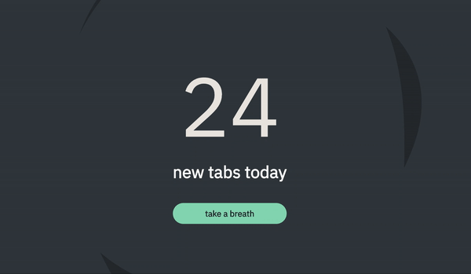

# React Scribble

React scribble is a react component that allows you to draw to canvas using hooks. This means that you can write individual component to draw a canvas in a declarative way.



## Why

Using canvas, and using the canvas api is fun. I had this idea of composing different canvas element together without nerfing the canvas api. This allows full access to the canvas api.

## Install

```shell
npm install react-scribble --save
# or
yarn add react-scribble
```

## Usage

You will need to setup the canvas and then use hooks to access the draw function.

### Setting up a canvas

Scribble outputs a component called Canvas. Render it and give it a height and width.

```javascript
import { Canvas } from 'react-scribble'

const MyCoolAppComponent = () => {
  return (
    <Canvas loop width={window.innerWidth} height={window.innerHeight}>
      {/* my projects components */}
    </Canvas>
  )
}
```

### Hooking into the draw

The hook allows you to pass a function to the useDraw hook, and that hook will be called every time the canvas is drawn.

```javascript
import { useCallback } from 'react'
import { useDraw } from 'react-scribble'

const Circle = ({ x, y }) => {
  // TEMP: draw functions currently need something
  // to stop the reference to stop updating
  const drawCircle = useCallback(
    (ctx, canvas) => {
      ctx.fillStyle = 'tomato'
      ctx.beginPath()
      ctx.arc(x, y, 50, 0, Math.PI * 2, true)
      ctx.fill()
    },
    [x, y]
  )

  useDraw(drawCircle) // draws the circle

  return null // you can return dom element here too.
}
```

### Composing all together

Then add the components with the draw hook into the canvas.

```javascript
const MyCoolAppComponent = () => {
  return (
    <Canvas loop width={window.innerWidth} height={window.innerHeight}>
      <Circle x={100} y={100} />
      <Circle x={window.innerWidth / 2} y={window.innerWidth / 2} />
    </Canvas>
  )
}
```

This should two circles to the canvas.

### Reseting the DOM view.

The view currently is not setup to handle viewing dom nodes above the canvas. That can easily be change by using the stage component.

```javascript
import { Canvas, Stage } from 'react-scribble'

const MyCoolAppComponent = () => {
  return (
    <Canvas loop width={window.innerWidth} height={window.innerHeight}>
      <Stage>
        <p> Now i am on the dom in front of the canvas </p>
      </Stage>
    </Canvas>
  )
}
```

## More examples

View the [examples](./examples) directory for more examples of how to use this component.
